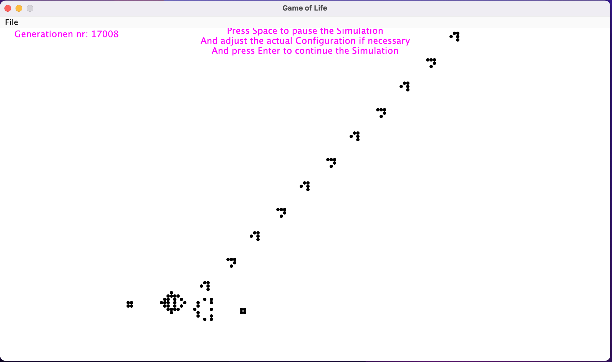

= Game Of Life && StandardDraw.
03.12.2021
:experimental:
:icons: font
:icon-set: octicon
:source-highlighter: rouge
ifdef::env-github[]
:tip-caption: :bulb:
:note-caption: :information_source:
:important-caption: :heavy_exclamation_mark:
:caution-caption: :fire:
:warning-caption: :warning:
endif::[]

= Game of Life

Das Spiel des Lebens (englisch Conway’s Game of Life) ist ein vom Mathematiker John Horton Conway 1970 entworfenes Spiel, basierend auf einem zweidimensionalen zellulären Automaten. Es ist eine einfache und bis heute populäre Umsetzung der Automaten-Theorie von Stanisław Marcin Ulam.
... wie https://de.wikipedia.org/wiki/Conways_Spiel_des_Lebens[Wikipedia] es beschreibt

==== #Beispiel Programm#

->in diesem Beispiel habe ich versuch die Simulation mittels Standard draw(für die graphishe oberfläche) zu erreichen.

-> nur folgende Regeln sind eingebaut für die Automation der Evolution der Zellen

    * ein  lebende Zelle beligt am leben wenn die Anzahl der Lebenden Nachbarn genau größer gleich 2 und kleiner gleich 3 beträgt, sonst stirbt Sie.

    * eine nicht Lebende wird zum leben geruffen , wenn sie genau 3 lebende Nachbarn hat, sonst bleibt sie inaktiv.

==== #Resources#

->Zur Verfügung steht schon das erste release zum ausprobieren.

-> Das ganze kann auch als gradle Projekt in einer EntwiklungUmgebung (Inteliji, Eclipse, ...) über die `Main` Klasse (in `src/main/java/Main`) gestartet (bzw. bearbeitet)

==== #Hinweise#

NOTE: Es ist leider noch keine so sehr effiziente Lösung , dass die (bis zu dritten ungefähr) Ersten Konfigurationen zu malen bis zu einer Minute (abhängig vom Rechner dauern kann) dauern kann, danch ist es aber schön flüssig.

==== #Bedienung#

Beim laufen kann das Programm durch zwei Tasten gesteuert

    * Die Taste `Space`(Leertaste) mit dessen Hilfe mann Das Spiel (bzw. Die Simulation) pausieren kann.

    * Die Taste `Enter` mit dessen Hilfe mann Das Spiel starten (bzw. fortsetzen kann)

TIP: Wenn Das Spiel paussiert ist kann man weiterhin ein Konfiguration einsetzen, oder die bestehende Konfiguration nach Vorlieben verändern und es wird beim fortsetzen der Simulation übernommen und weiter nach den Regel entwikelt

TIP: Halte deine hand über die Mausse(Links-Klick) und bewege Sie je machdem welche ligne (bzw. Configuration) gemalt werden sollte; es werden schon ein paar Zeillen gleichzeitig ein- oder ausgeschaltet, anstatt jeder einzelnes Feld anzuklicken

NOTE: Beim Starten des programm kann man (bzw. soll man) erstmal ein konfiguration zeichen bevor man `Enter` drück, sonst passiert nicht, weil alle Zelle per default iaktiv sind.

IMPORTANT: Der Feld ist immer begrentz, die Teile die den Rand überschreiten werden entweder nicht mehr betrachtet oder wird deren Evolution blockiert(bzw. umgeleitet) Der gleite.png[gleiter] wird hier bespielsweise am Rand zum vierteiligen Block.

==== Abbildungen

->Laufendes Programm Beispiel 1

->Laufendes Programm Beispiel 2

->Laufendes Programm Beispiel 3

->Laufendes Programm Beispiel 4

->Änderung in der Pause 4 (Auf Französish: le Canon a planneur)

image::src/main/resources/andärungInDerPause.png[Laufendes Programm Beispiel 5]

->Laufendes Programm Beispiel 5 (Auf Französish: le Canon a planneur)

Natürlich Können Sie andere Start Configurationen ausprobieren und die Evolution aller deren Generationen beobachten.
